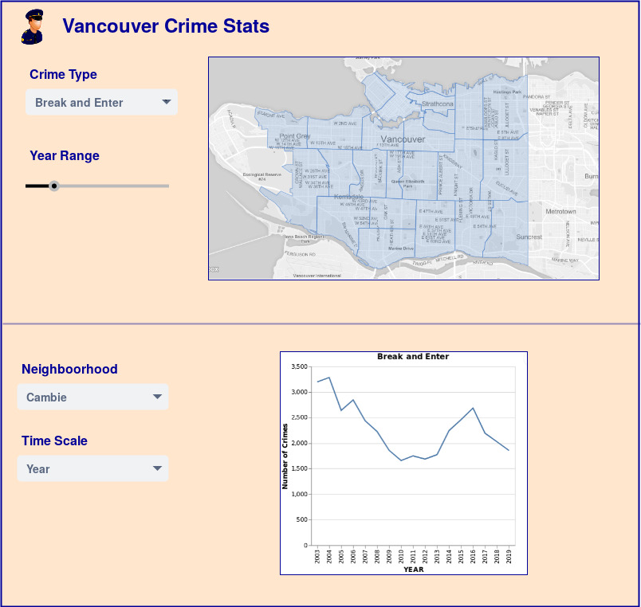

# DSCI-532-Group108

Team members: Frank Lu, Derek Kruszewski, Tao Guo  

## Description of APP  
This APP is intended to show the historical crime data in a geo-temporal form.  To achieve this, it will display a choropleth of City of Vancouver for showing neighbourhoods and a line chart for showing the relationship between crime count and time.   This APP will be interactive and allows its users to specify the neighbourhood, crime type, and time scale to gain more understanding of how crimes are correlated to the neighbourhoods and time.
  
On the choropleth, the number of crimes in different neighbourhoods is colour-coded so that users can easily relate the count of a crime type to its relative location in Vancouver.  A dropdown list will be added for choosing the crime type.  There will also be a slider bar for changing the year range of the crime data, in case some users might be interested in a more recent crime data.  
  
In the line chart, we intend to show how the count of crimes in a neighbourhood varies with time.  So, there will be two dropdown lists accompanying the line chart: one for selecting the neighbourhood, and the other for selecting the time scale.  This way, the users can easily see the specified neighbourhood’s criminal trend in terms of the time, date, month or year.  
  

